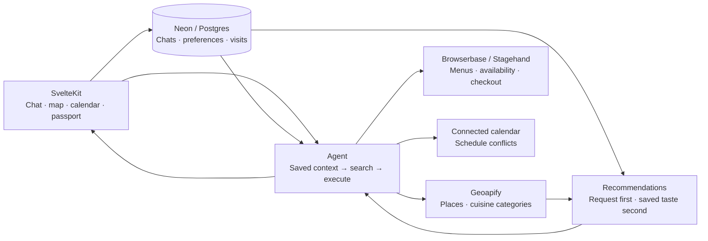

# Concierge

Find a restaurant, check a time, and reach checkout through a conversation. You make the final booking.

**[Try Concierge](https://concierge-pearl.vercel.app)**

*Ai Fiori · two guests · 7 pm · OpenTable checkout*

## The experience

- Ask naturally; date, time and guest controls appear when needed.
- Explore an updating map and sourced menus, with saved taste guiding open-ended searches.
- Keep chats, check calendar conflicts, and collect visits in your passport.

## Architecture

The agent discovers tools with `search` and calls them with `execute`. Recommendations rank sourced cuisine matches deterministically: the current request first, saved taste second. Selected dishes enrich conversation context. Browserbase and Stagehand inspect reservation services such as OpenTable and SevenRooms, verify availability, and recheck the chosen time before handing checkout to you.

**Cost choices:** Chat and menu extraction use GPT-6 Luna through OpenRouter. Ranking needs no model call; saved summaries spread conversation-compaction work across later turns. Bounded preference history, tool steps and browser searches constrain per-request work, while bookable times are checked fresh.

Better Auth owns sessions; the AI SDK streams replies through OpenRouter. Account-owned chat storage keeps explicit choices across conversations. A restaurant listing can inform a recommendation; verified provider inventory supplies bookable times.

## Evaluations

47/47 selected regression checks passed. Sentry’s 283 traced tool executions show where time goes: reservation checks take 10 seconds at the median and 47 seconds at p95.

[Runtime performance](https://concierge-vn.sentry.io/explore/traces/?query=span.op%3Aagent.tool&project=4512153271336960&statsPeriod=7d) · [Regression scores](https://www.braintrust.dev/app/holdthatheat/p/Concierge/experiments/observed-browser-journeys-2026-09-28T04-39-04-117Z)

## Developer workflow

A failed conversation becomes a regression case: Playwright reproduces it, Sentry locates the failing request, and Braintrust scores the decisions. Fix, replay, then verify the journey. Fast checks run first; recorded calls can be rescored without another generation.

[Checkout repair](proof/README.md) · [Tests](app/tests/readiness.md)

## Next

Reservation confirmation, reminders and post-visit follow-ups; better alternatives when a preferred restaurant has no suitable time. Strengthen taste profiles with explicit feedback and context, so recommendations learn what you enjoy without treating every click as a preference or overriding today’s request.
