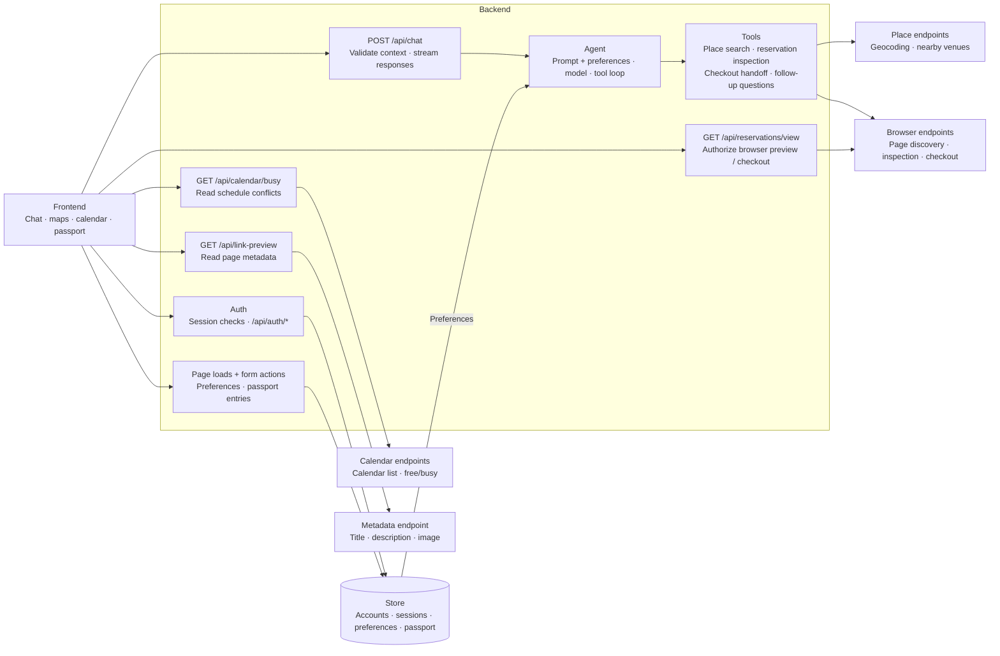

# Concierge

A conversational concierge for finding places and exploring reservations.

[Open the app](https://concierge-pearl.vercel.app)

## Architecture

## Reservation services

- [OpenTable](https://www.opentable.com/)
- [SevenRooms](https://sevenrooms.com/)
