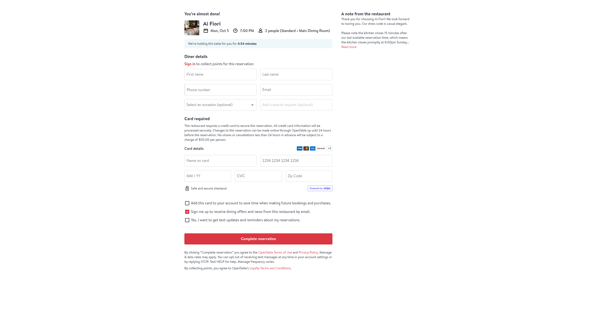

# Reservation checkout evidence

On September 26, 2026, a public Ai Fiori reservation for two on September 28 at 7:15 pm reached SevenRooms checkout. The page placed a temporary hold and requested guest details and a payment method. I stopped before entering either or submitting the reservation.

[Checkout screenshot](sevenrooms-checkout-2026-09-26.jpg) is a viewport capture with no personal or card details. It proves the provider path reaches checkout, not that Concierge completed a booking.


## Concierge to OpenTable — September 28, 2026

The local production app completed real discovery → verified 7 pm selection → fresh slot check → provider guest-details/review for Ai Fiori, October 5, 2026, two guests. Playwright independently read the retained provider page and verified blank name fields. The provider required card details and displayed cancellation terms; the final Complete reservation button remained untouched.



[Journey GIF](reservation-journey.gif) is an accelerated app recording followed by the actual provider screenshot. It is an observed happy path, not a completed booking or a universal availability guarantee. Test sessions are released after verification.

[Braintrust before/after evaluation](https://www.braintrust.dev/app/holdthatheat/p/Concierge/experiments/observed-browser-journeys-2026-09-28T05-42-15-397Z) retains the initial disabled-checkout failure and repaired journey separately. [Successful Sentry trace](https://concierge-vn.sentry.io/explore/traces/trace/e56f176c042e412c8dcc6abdf44fe208) reports zero errors.

Reproduce from `app/` with the existing authenticated local session:

```sh
RUN_LIVE_RESERVATION=1 LIVE_RESERVATION_DATE=2026-10-05 E2E_PRODUCTION=1 bunx playwright test tests/reservation.spec.ts --grep 'live reservation search reaches'
```

Choose a future date with inventory when rerunning. Auth, raw transcripts, recordings and test cases stay gitignored in `app/tests/`; only reviewed demo media lives here. Hosted deployment, fresh sign-in and calendar authorization are separate proof gates.


## Evaluation chart sources — September 28, 2026

The [latency plot](tool-latency-2026-09-28.svg) uses a fresh [Sentry aggregate query](https://concierge-vn.sentry.io/explore/traces/?query=span.op%3Aagent.tool&project=4512153271336960&statsPeriod=7d) over seven days: `span.op:agent.tool`, grouped by `span.description`, with `count()`, `p50(span.duration)` and `p95(span.duration)`. Durations are converted from milliseconds to seconds. The four planning tools shown account for 266 of 283 spans; the other 17 are clock, named lookup and weather calls. The `production` environment tag includes development production-build tests, so these counts are traced executions, not distinct customer requests.

| Tool | Spans | Median | p95 |
| --- | ---: | ---: | ---: |
| Follow-up | 64 | 0.30 ms | 1.97 ms |
| Place search | 47 | 0.73 s | 2.16 s |
| Reservation check | 148 | 9.98 s | 46.86 s |
| Checkout preparation | 7 | 17.36 s | 46.97 s |

The [Braintrust regression cohort](https://www.braintrust.dev/app/holdthatheat/p/Concierge/experiments/observed-browser-journeys-2026-09-28T04-39-04-117Z) was queried directly: 47/47 `testContractCompleted`, 33/33 `browserJourneyCompleted`, and 20/20 `chatTransportCompleted`. Null/inapplicable scores are excluded from each denominator. The selected cohort comprises 28 mocked, seven API, six live and six setup cases. These scores describe regression checks, not a production booking-success rate. Raw query exports stay in gitignored `app/tests/local/`; chart data and source identifiers are embedded in the SVG metadata.
